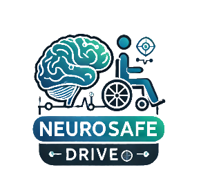

# 🧠 Neurosafe



Neurosafe is a modern web application designed to enhance user well-being through various features focused on health, gender, and other aspects. This project is organized into frontend, backend, and design assets.

## 🗂️ Project Structure

```
.
├── Frontend
│   ├── src
│   │   ├── assets
│   │   │   ├── animations
│   │   │   └── styles
│   │   │       ├── base
│   │   │       └── reusable
│   │   │           ├── base.all.scss
│   │   │           └── reusable.all.scss
│   │   │       └── react.svg
│   │   ├── pages
│   │   │   ├── Gender
│   │   │   ├── Health
│   │   │   ├── Home
│   │   │   ├── Login
│   │   │   └── Signup
│   │   └── utils
│   │       ├── FilterThemeTag.js
│   │       ├── App.css
│   │       ├── App.jsx
│   │       ├── index.css
│   │       ├── main.jsx
│   │       └── serviceWorkerRegistration.js
│   ├── .eslintrc.cjs
│   ├── .gitignore
│   ├── index.html
│   ├── package-lock.json
│   ├── package.json
│   ├── README.md
│   └── vite.config.js
├── Backend (empty)
├── Figma
│   ├── [design-assets]
│   └── [images]
```

## 🚀 Getting Started

### Prerequisites

- Node.js
- npm or yarn

### Installation

1. Clone the repository:

    ```bash
    git clone https://github.com/your-username/neurosafe.git
    ```

2. Navigate to the frontend directory:

    ```bash
    cd neurosafe/Frontend
    ```

3. Install dependencies:

    ```bash
    npm install
    ```

### Running the Application

To start the development server, run:

```bash
npm run dev
```

This will start the Vite development server, and you can access the application at `http://localhost:5000`.

### Building the Application

To build the application for production, run:

```bash
npm run build
```

The output will be in the `dist` directory.

## 🤝 Contributing

We welcome contributions! Please see the [CONTRIBUTING.md](CONTRIBUTING.md) for more information.

## 📄 License

This project is licensed under the MIT License - see the [LICENSE](LICENSE) file for details.

## 📫 Contact

For any questions or inquiries, please contact [markwasfy00@gmail.com].

---

[](https://www.figma.com/proto/QM5f2OxChgCADYFNrOxzfX/Untitled?node-id=12-64&m=dev&scaling=scale-down&content-scaling=fixed&page-id=0%3A1&starting-point-node-id=1%3A2&show-proto-sidebar=1&t=nEKiOD5rqTkAXS9E-1)
